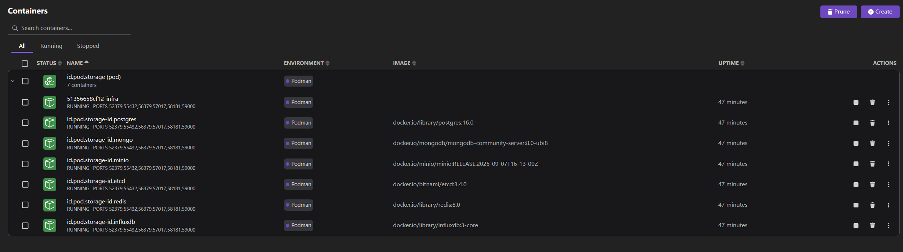
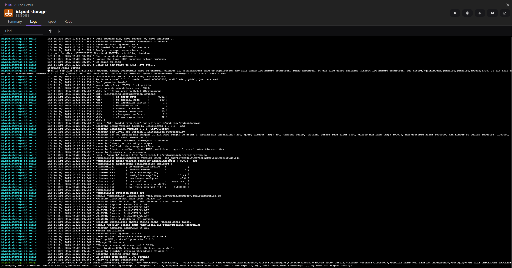

# 基于 Podman 一键混合编排多维度数据库

| 名称       | 类型 |
| --------- | ----------------------------------------------- |
| PostgreSQL | 关系型数据库 |
| MongoDB   | 文档型数据库 |
| MinIO     | 对象存储数据库 |
| ETCD      | 分布式键值型数据库 |
| Redis     | 内存型键值型数据库 |
| InfluxDB  | 时间序列型数据库 |

构建结果, 如下:

