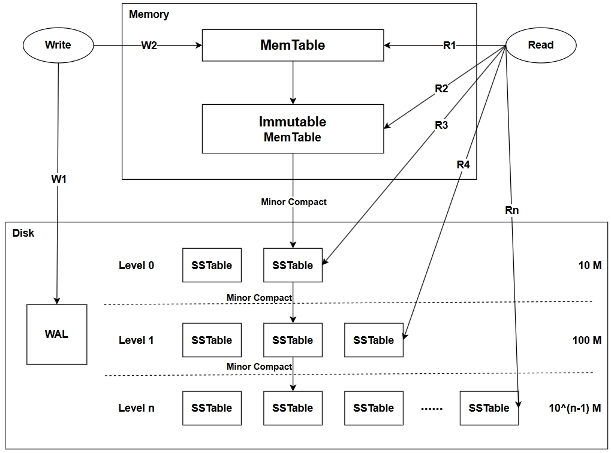
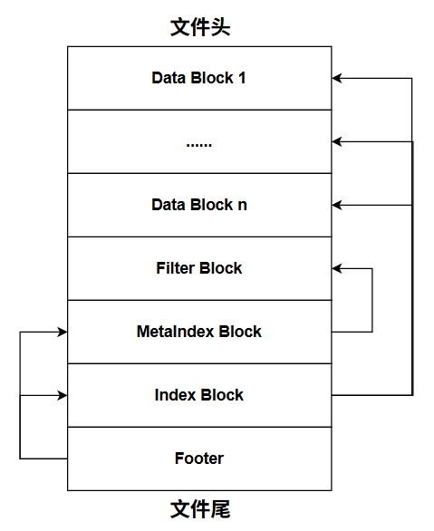
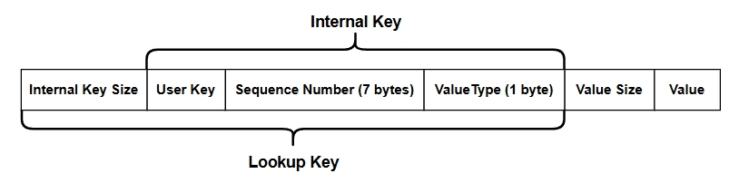
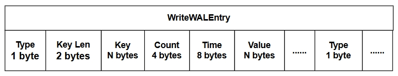
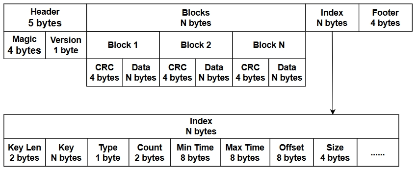

# InfluxDB

## 一、背景
```
针对IoT（物联网）及生产制造业，数据采集、存储及分析等场景。需选择一款适配业务场景的数据库。
```

## 二、概要
```
对时序数据库（TSDB）结构及原理进行解析，同时以InfluxDB为代表，并展开论述。
InfluxDB是一个开源的时序数据库，用于存储和查询时间序列数据。它是由InfluxData开发的，最初是为了存储和查询InfluxData的时序数据而设计的。
InfluxDB的设计目标是提供高性能、可扩展性和易用性。它支持多种数据模型，包括时间序列数据、事件数据和键值数据。
```

## 三、名词解释
| 名称 | 全称 | 解释 |
| --- | --- | --- |
| TSDB             | Time Series Database | 时间序列数据库，用于存储和查询时间序列数据 |
| RMDBS            | Relational Map Database System | 关系型数据库，用于存储和查询关系型数据 |
| B+ Tree          | Balanced Plus Tree | 一种平衡树 |
| LSM-Tree         | Log-Structed Merge-Tree | 日志结构合并树，一种基于磁盘的键值存储结构 |
| TSM-Tree         | Time-Series Merge-Tree  | 时间序列合并树，一种用于存储和查询时间序列数据的结构 |
| SSTable          | ​Sorted String Table | 排序字符串表，一种基于磁盘的键值存储结构 |
| MemTable         | Memery Table | 一种基于内存的键值存储结构 |
| IOPS             | Input/Output Operations Per Second | 每秒输入/输出操作次数 |
| WAL              | Write-Ahead Logging | 预写日志，一种用于保证数据一致性的机制 |
| Point            | —— | 一个时间序列数据点，包含时间戳、标签和字段，相当于一条记录（record）|
| Series           | —— | 一个时间序列，由一个或多个数据点组成，具有相同的标签集合。同一Series的数据在物理上会按照时间顺序排列在一起 |
| Shard            | —— | 一个物理分区，用于存储和管理数据。每个Shard包含一个或多个Series |
| Retention Policy | —— | 保留策略，包括设置数据保存的时间以及在集群中的副本个数 |
| Measurement      | —— | 一个时间序列的名称，相当于一个表名 |
| Tag              | —— | 一个键值对，用于标识一个时间序列 |
| Field            | —— | 一个键值对，用于存储一个时间序列的数据 |
| Timestamp        | —— | 一个时间戳，用于标识一个时间序列的数据点 |

## 四、结构及原理
### 4.1 写入/读取顺序
#### 4.1.1 落盘路径
写入时，先记录进持久化日志，而后加载入缓存栈，当数据达到一定量级，压缩为数据层，同时落盘，写入SSTable文件
```
Request(写入请求) -> WAL(日志持久化) -> MemTable(内存缓存) -> SSTable(刷盘)
```
#### 4.1.2 读盘路径
查询时，先查 MemTable，再逐层查询磁盘上的 SSTable
```
Request(查询请求) -> MemTable(内存缓存) -> SSTable(磁盘)
```
### 4.2 组件特性 
#### 4.2.1 LSM Tree 结构

#### 4.2.2 SSTable（排序字符表）
##### 4.2.2.1 描述
- SSTable 是一种持久化的、按键排序的不可变（Immutable）数据结构，通常用于存储大量键值对（Key-Value）
- 数据一旦写入文件，​不再修改，更新和删除通过追加新记录实现（类似日志结构存储）
##### 4.2.2.2 特性
- 排序存储​：所有键值对按键（Key）有序排列，支持高效的范围查询和压缩
- 不可变性​：写入后文件内容固定，通过后台合并（Compaction）优化存储和查询性能
##### 4.2.2.3 结构

##### 4.2.2.4 SSTable 与 LSM Tree 关系
- SSTable 是 ​LSM Tree 的磁盘层实现
- 数据先写入内存（MemTable），再刷盘为 SSTable 文件，最后通过合并（Merge）减少冗余
- 文件结构示例
```
Data Blocks（按Key排序的键值对）
Index Block（记录每个Data Block的起始Key和偏移量）
Bloom Filter（用于判断Key是否存在）
Footer（元信息，记录索引和过滤器的位置）
```
#### 4.2.3 MemTable（内存表）
##### 4.2.3.1 描述
- MemTable 是一种基于内存的临时数据结构，用于在 LSM Tree存储引擎中缓存写入操作
- 数据首先写入 MemTable（内存中），达到一定大小后才会刷盘（Flush）到磁盘，形成 ​SSTable
##### 4.2.3.2 特性
- 内存存储：读写速度极快，但数据易丢失，通常需依赖WAL
- 有序性：MemTable 通常按 Key 排序存储，以便高效查询和后续刷盘成有序 SSTable
- 临时性：数据最终会被持久化到磁盘，MemTable 会被周期性地替换
##### 4.2.3.3 结构

##### 4.2.3.4 MemTable 与 其他组件关系
| 组件 | 存储介质 | 作用 | 是否可变 |
| --- | ------- | --- | ------- |
| MemTable | 内存 | 缓存写入，支持快速读写 | 可变 |
| SSTable | 磁盘 | 持久化数据，有序存储 | 不可变 |
| WAL | 磁盘 | 防止 MemTable 数据丢失 | 只追加 |
#### 4.2.4 WAL（预写日志）

### 4.3 存储引擎结构
#### 4.3.1 LevelDB 存储引擎
（#TODO: 待完善）
#### 4.3.2 BoltDB 存储引擎
请参见：[BoltDB存储引擎](https://gitee.com/ID-moonlab/ID-open-source/blob/master/About-Database/BoltDB/README.md)
#### 4.3.3 TSM 存储引擎
（#TODO: 待完善）
| 版本 | 存储引擎 | 特性 | 备注 |
| --- | ------- | --- | --- |
| 1.x | LevelDB/BoltDB | 高写入吞吐，结构简单 | 不支持分布式 |
| 2.x | TSM | 性能提升，支持Flux查询 | 支持分布式 |
| 3.x | Arrow/Parquet | 支持列式存储、面向云原生 | 支持分布式 |
### 4.4 存储文件结构
#### 4.4.1 WAL文件结构

#### 4.4.2 TSM文件结构

### 4.5 源数据结构
（#TODO: 待完善）

## 五、Q&A
### 5.1 为什么使用时序数据库（TSDB）而不是关系型数据库（RMDBS）
#### 5.1.1 写入性能差异
```
RMDBS，通常采用B+ Tree索引结构，插入数据时，需要对索引进行分裂或合并，这会导致大量的磁盘IO操作，从而影响写入性能。在大批量数据操作时，容易产生随机读写，继而触发页裂变，降低写入速度
TSDB，采用LSM-Tree索引结构，插入数据时，不需要对索引进行分裂或合并，而是将数据写入内存中的MemTable，当MemTable达到一定大小时，将其合并成SSTable文件，并顺序写入磁盘，保证写入速度
```
| 特性 | B+ Tree | LSM Tree |
| --- | ------- | -------- |
| ​写入放大 | 低（直接更新页）| 高（Compaction 合并）|
| 随机 I/O | 高（分裂/合并需随机写）| 低（顺序写 SSTable）|
| 读取性能 | 稳定（树高度固定）| 可能多层查询（SSTable）|
| 适用场景 | 读多写少（OLTP）| 写多读少（时序/日志）|
#### 5.1.2 数据存储差异
```
RMDBS，通常数据存入后，直接落盘
TSDB，通常采用冷热分离的设计理念。即当下时段热数据，保留在内存中，等待查询，时段之外的历史数据，被压缩后放到磁盘里，从而节省资源空间
```
#### 5.1.3 数据结构差异
```
RMDBS，采用B+ Tree结构，读写性能均衡
TSDB，采用LSM Tree结构，数据分层压缩，"只写不改"，极大的提高写入性能和读取性能
```

## 六、源码地址
```
https://github.com/influxdata/influxdb
```
